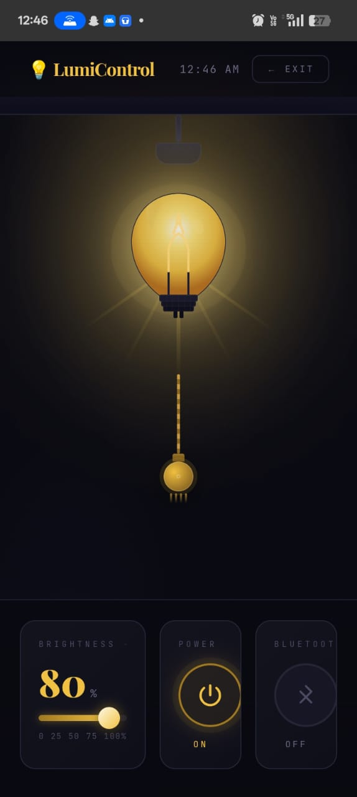
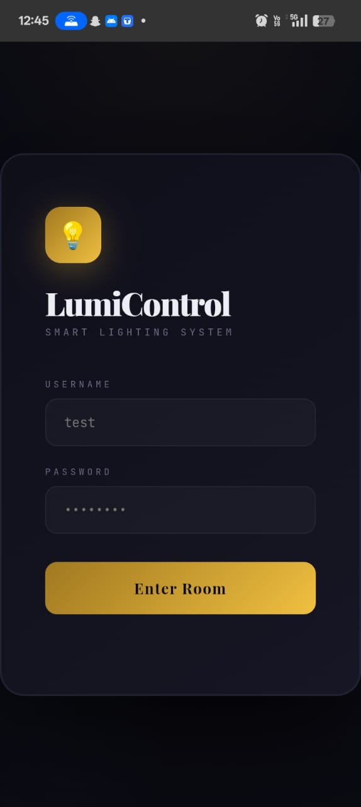

# 📱 Light Control App

## 📸 App Screenshots

## 📸 App Screenshots

## 🎥 Demo Video

[Click here to watch demo](VIDEO-2026-05-06-01-26-34.mp4)

## 📥 Download App

👉 https://github.com/Shaaaa-lab/Light-Control-App/releases/download/v1.0/app-release.apk

## 📌 Features

* Control light intensity using mobile
* Simple and user-friendly interface
* Real-time hardware control

## 🛠️ Tech Stack

* Android (Java/Kotlin)
* Hardware Integration

## 📲 Installation Steps

1. Download the APK from the link above
2. Enable "Install from Unknown Sources"
3. Install and open the app

## 👨‍💻 Developer

Shaik Shah Baba

